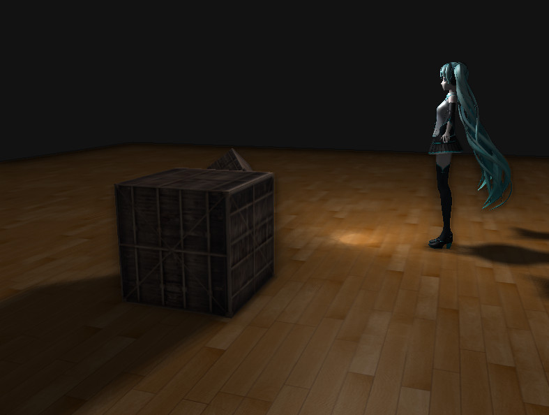
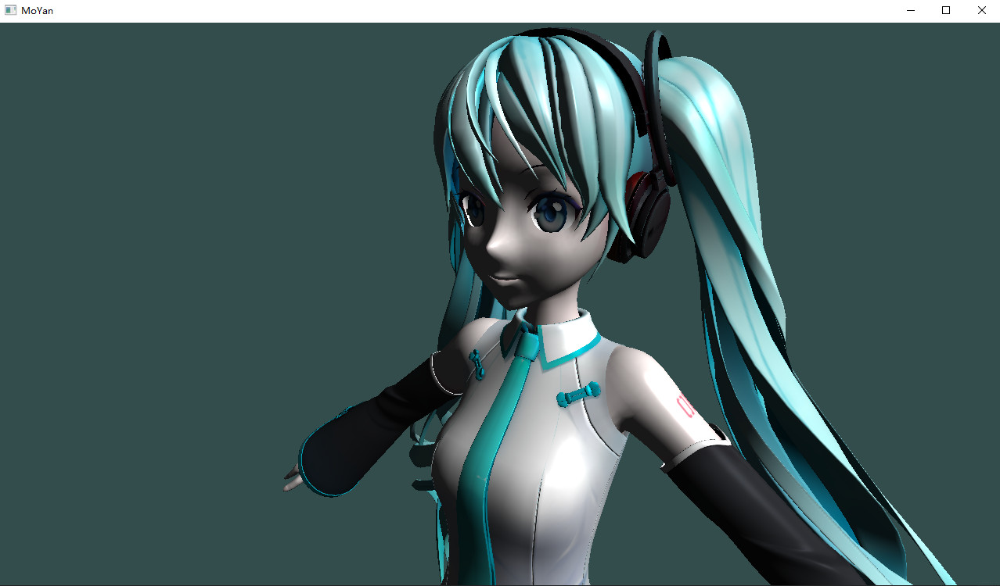
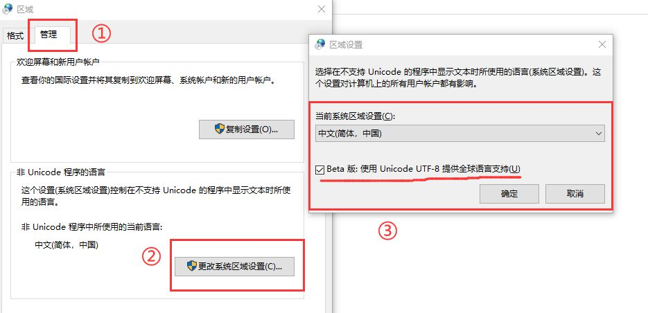

## PMX_Model_Viewer_with_PhongLight

使用Phong光照模型渲染`.pmx`格式的模型：

### :computer:开发环境

- OS：Win10。

- IDE：Visual studio 2022。
- 项目中使用到的库在`Dependencies`和`PMX_Files_Viewer\external`中。

### :hammer_and_wrench:如何使用

1. 使用Visual studio打开 `PMX_Files_Viewer.sln` 文件，并运行。

2. 操作：

   - `W`向前；
   - `S`向后；
   - `A`向左；
   - `D`向右；
   - `[`向上
   - `]`向下；
   - `鼠标`按住并拖动可以移动视角。

2. 通过修改`PMX_Files_Viewer\resource\configs\model.config`文件可以更换需要渲染的模型。

3. 如果出现`由于无法找到 assimp-vc143-mt.dll...`的提示，需要将`Dependencies\dll`下面的`assimp-vc143-mt.dll`复制到项目中的`Debug`或`Release`中（即和`PMX_Files_Viewer.exe`放在同一目录下）。

4. 如果`.pmx`模型或贴图路径中存在中文可能会报错，我感觉这是assimp库中的一个遗留问题 [assimp/issues/1612#](https://github.com/assimp/assimp/issues/1612#)。我自己的解决方案是修改系统的编码方式：

   

5. 如果无法运行，可以根据自己的操作系统使用`cmake`重新编译库文件并引入项目，具体步骤可以参考：[LearnOpenGL](https://learnopengl.com/Getting-started/Creating-a-window)、[LearnOpenGL-CN](https://learnopengl-cn.github.io/01%20Getting%20started/02%20Creating%20a%20window/)。

### :key:实现方法

1. 使用Assimp库读取`.pmx`格式的模型，并将模型中顶点（位置、法线、UV贴图）和面（点的下标的集合）等读取出来并存入到OpenGL的缓冲中。
2. 定义相机的抽象类，用欧拉角来定义相机的旋转，通过鼠标和键盘的输入来控制旋转的方向和角度。并且通过相机的参数可以得到VP矩阵（View Matrix, Projection Matrix），使用MVP矩阵将顶点和向量移动到相机坐标系下。从而使得OpenGL渲染出来的图片是相机坐标系下的看到的效果。
3. 在fragment shader中实现Phong模型（ambient+diffuse+specular）。
